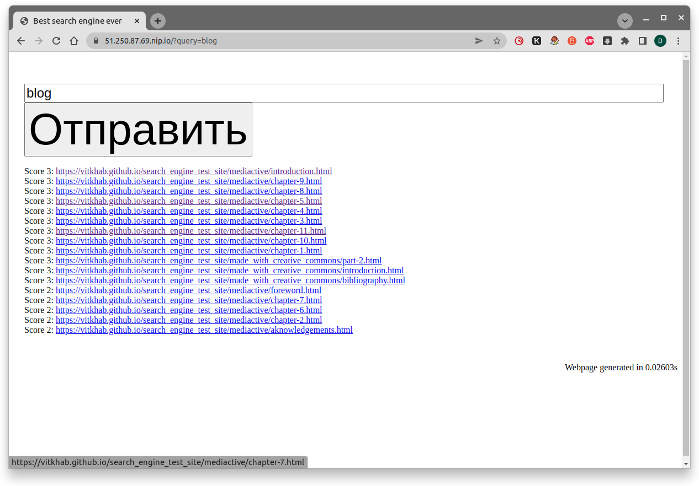
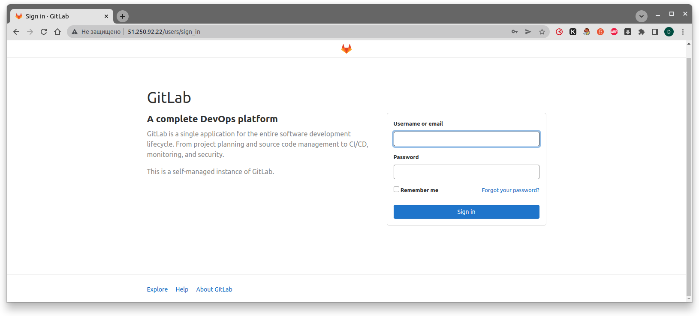
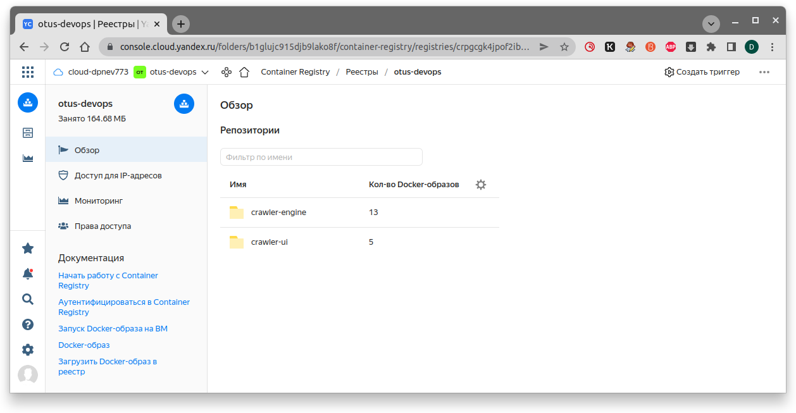
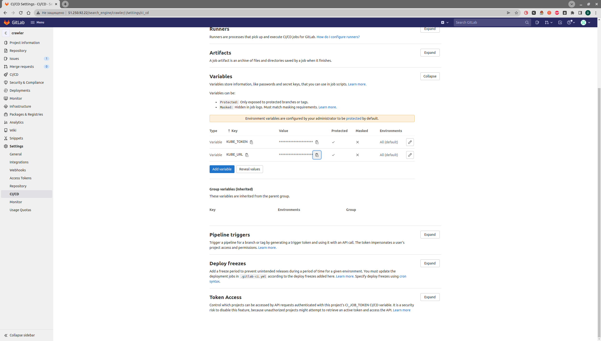
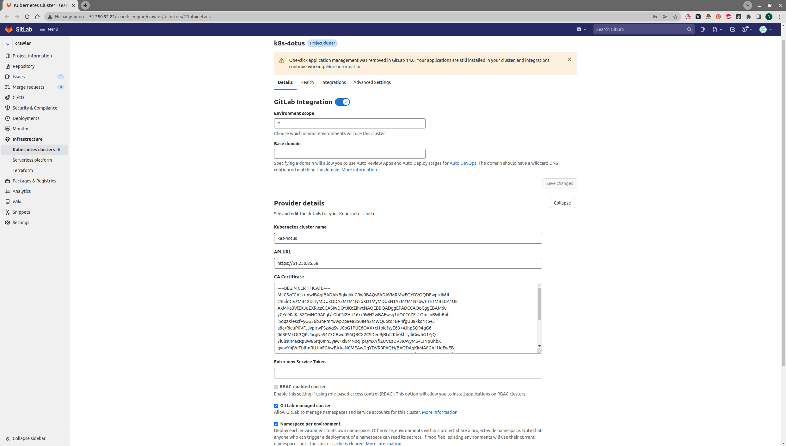

# crawler
## Crawler CI/CD repository. OTUS DevOps graduation project

## Требования к проекту
- Автоматизированные процессы создания и управления платформой
  - Ресурсы Ya.cloud
  - Инфраструктура для CI/CD
  -Инфраструктура для сбора обратной связи
- Использование практики IaC (Infrastructure as Code) для управления конфигурацией и инфраструктурой
- Настроен процесс CI/CD
- Все, что имеет отношение к проекту хранится в Git
- Настроен процесс сбора обратной связи
  - Мониторинг (сбор метрик, алертинг, визуализация)
  - Логирование (опционально)
  - Трейсинг (опционально)
  - ChatOps (опционально)
- Документация
  - README по работе с репозиторием
  - Описание приложения и его архитектуры
  - How to start?
  - ScreenCast
- CHANGELOG с описанием выполненной работы

## План
- Создать makefile для сборки образов
- Создать docker-compose.yml для сборки приложения
- Подготовить инфру для поднятия кубера и развертывания приложения в нем
- Развернуть инфру и GitLab в ней для CI/CD 

## Выполнено:

## 1. Создан makefile для сборки образов
~~~bash
cd ./docker
make
~~~

## 2. Создан docker-compose.yml для сборки приложения
~~~bash
➜  docker git:(main) docker-compose up -d
➜  docker git:(main) curl http://localhost:8000
<!doctype html>
<html>
    <head>
        <title>Best search engine ever</title>
        <style type="text/css">
        body, html {

  ...
  ~~~

## 3. Деплой приложения в k8s
~~~bash
cd ./crawler/terraform-k8s/  
terraform init
terraform apply --auto-approve
helm install ingress-nginx ingress-nginx/ingress-nginx
helm repo add jetstack https://charts.jetstack.io
helm repo update
helm install \
  cert-manager jetstack/cert-manager \
  --namespace cert-manager \
  --create-namespace \
  --set installCRDs=true \
  --version v1.8.0 \
  --set prometheus.enabled=false \
  --set webhook.timeoutSeconds=4
kubectl --namespace default get services -o wide -w ingress-nginx-controller
~~~

### Вносим адреса сервисов в 'crawler/k8s/crawler/ui-ingress.yml'
~~~yaml
spec:
  tls:
    - hosts:
      - 51.250.87.69.nip.io
      - grafana.51.250.87.69.nip.io
      - prometheus.51.250.87.69.nip.io
      secretName: letsencrypt
  rules:
    - host: 51.250.87.69.nip.io
 ...
    - host: grafana.51.250.87.69.nip.io
 ...
    - host: prometheus.51.250.87.69.nip.io
 ...
 ~~~

### Деплоим приклад
~~~bash
kubectl apply -f ../k8s/crawler/
~~~

### Проверяем [https://51.250.87.69.nip.io/?query=blog](https://51.250.87.69.nip.io/?query=blog)

## 4. Настройка CI/CD [https://cloud.yandex.com/en-ru/docs/tutorials/infrastructure-management/gitlab-containers](https://cloud.yandex.com/en-ru/docs/tutorials/infrastructure-management/gitlab-containers)

### Поднимаем GitLab
~~~bash
cd crawler/gitlab-ci/terraform
terraform apply --auto-approve
~~~

### Вспоминаем пароль по умолчанию
~~~bash
crawler/gitlab-ci/ansible
➜  ansible git:(main) ✗ ansible-playbook playbook.yml
...
TASK [config-gitlab-ci : debug] **************************************************************************************************************************************************************************************************************************************************
ok: [gitlab-ci-vm-0] => {
    "msg": "content of remote file /etc/gitlab/initial_root_password: z7M17GY5B4l259DH0HINubh8tVnzNRotf4E3jJ6nAC8="
}
...
~~~

### Проверяем UI GitLab [http://51.250.92.22/users/sign_in](http://51.250.92.22/users/sign_in)

### Создадим реестр Container Registry от Yandex Cloud

### Внесем endpoint инстанса GitLab и токен из [http://51.250.92.22/search_engine/crawler/-/settings/ci_cd](http://51.250.92.22/search_engine/crawler/-/settings/ci_cd) в `crawler/k8s/monitoring/values.yml`
~~~yml
gitlabUrl: http://51.250.92.22/
runnerRegistrationToken: "token"
~~~

### Создадим GitLab Runner в k8s
~~~bash
helm repo add gitlab https://charts.gitlab.io
helm install --namespace default gitlab-runner -f values.yaml gitlab/gitlab-runner
# Проверим успешный запуск раннера
kubectl get pods -n default | grep gitlab-runner
~~~

### Настроим сборку и развертывание в k8s из GitLab

#### Получим токен сервисного аккаунта Kubernetes для аутентификации в GitLab 
~~~bash
cd crawler/k8s/gitlab-ci
kubectl apply -f gitlab-admin-service-account.yaml
kubectl -n kube-system get secrets -o json | jq -r '.items[] | select(.metadata.name | startswith("gitlab-admin")) | .data.token' | base64 --decode > token.txt
~~~

#### Уточним CA сертификат кластера
~~~bash
yc managed-kubernetes cluster get k8s-otus --format=json | jq -r .master.master_auth.cluster_ca_certificate
-----BEGIN CERTIFICATE-----
MIIC5zCCAc+gAwIBAgIBADANBgkqhkiG9w0BAQsFADAVMRMwEQYDVQQDEwprdWJl
...
-----END CERTIFICATE-----
~~~

#### Создадим переменные окружения GitLab [http://51.250.92.22/search_engine/crawler/-/settings/ci_cd](http://51.250.92.22/search_engine/crawler/-/settings/ci_cd)

#### Подключим k8s для развертывания в нём проекта `search_engine/crawler` к раннеру GitLab [http://51.250.92.22/search_engine/crawler/-/clusters/2?tab=details](http://51.250.92.22/search_engine/crawler/-/clusters/2?tab=details)

#### Проверяем
~~~bash
git remote add gitlab git@51.250.92.22:search_engine/crawler.git
git commit -m 'GitLab pipeline test'
git tag Test
git push gitlab --tags
~~~